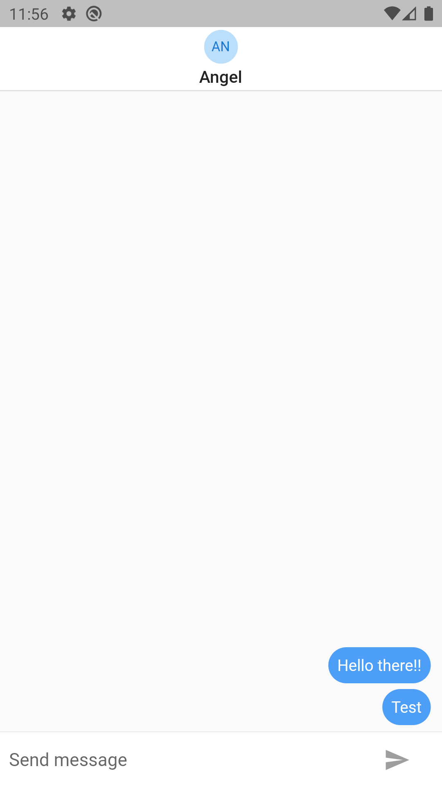

# chat_app
Chat App from Advanced Flutter course

App Features:
* JWT Auth
* Rest connection
* Socket connection
* State management with Provider

This app connects to a [server](https://github.com/mangelsr/chat_app_server) via sockets

## Screenshots
### Login Page

### Register Page

### Main Page

### Chat Page
